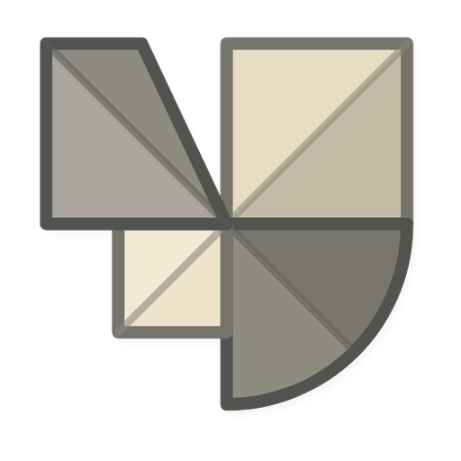

# Origamiz 

**Origamiz** is a shape-folding factory-automation game, forked from the GPL-3.0-licensed
[shapez Community Edition](https://github.com/tobspr-games/shapez-community-edition), which is
itself a community-maintained continuation of [shapez](https://store.steampowered.com/app/1318690/shapez/)
by tobspr Games.

> [!IMPORTANT]
> Origamiz is an independent project and is not affiliated with, endorsed by, or
> associated with tobspr Games or the official shapez/Shapez 2 games.

As of now, Origamiz must be built from source and supports only a standalone build,
with no plans for re-supporting a web version.

## Contributing

<!-- TODO: point this at Origamiz's own community channel once one exists. -->

If you would like to contribute, feel free to fork the repo and open a pull request.

> [!TIP]
> Because the game is licensed under the [GNU GPL v3.0](https://www.gnu.org/licenses/gpl-3.0.html),
> pull requests originally made against the upstream shapez/shapez-community-edition repositories
> can be resubmitted here even if you aren't the author! **This is not legal advice.**

### Code

The game uses a custom engine originally based on the YORG.io 3 game engine.
The code within the engine is relatively clean with some code for the actual game on top being hacky.

We are in the process of migrating to TypeScript and JSX/TSX.
New changes should be implemented in TypeScript if possible,
but because we are planning on overhauling many parts of the game,
there is no need to convert existing code to TypeScript.

This project is fine with using cutting-edge and bleeding-edge features
and does not intend to provide compatibility for older clients.

## Building

### Prerequisites

-   [Node.js](https://nodejs.org)
-   [ffmpeg](https://www.ffmpeg.org/download.html) for audio transcoding
-   [Java](https://www.oracle.com/java/technologies/downloads/) (or [OpenJDK](https://openjdk.org/)) to run the texture packer

### Development

-   Run `npm i` in the root folder and in `electron/`.
-   Run `npm run gulp` in the root folder to build and serve files.
    If a new browser tab opens, ignore it.
-   Open a new terminal and run `npm start` in `electron/` to open an Electron window.
    -   Use `npm start -- --dev` to run in development mode.
    -   Tip: If you open the Electron window too early, you can reload it when focused on DevTools.

### Release

-   Run `npm i` in the root folder and in `electron/`.
-   In the root folder, run `npm run package-$PLATFORM-$ARCH` where:
    -   `$PLATFORM` is `win32`, `linux` or `darwin` depending on your system.
    -   `$ARCH` is the target system architecture (`x64` or `arm64`)
-   The build will be found under `build_output/standalone` as `origamiz-...`.

### Building with Docker

You can build without installing Node, Java, or ffmpeg on the host. From the repo root, build the image and run a package task with a volume so output appears in `build_output/` on your machine:

```bash
docker build -t origamiz-builder .
docker run --rm -v "$(pwd)/build_output:/output" origamiz-builder package.standalone.linux-x64
```

On Apple Silicon add `--platform linux/amd64` to the build command. For other targets use e.g. `package.standalone.win32-x64`. Darwin builds are best done on macOS.

## Credits

Origamiz is a fork of [shapez Community Edition](https://github.com/tobspr-games/shapez-community-edition),
itself built on [shapez](https://tobspr.io) by tobspr Games. Thanks to tobspr Games and the CE
community for the original game this project is derived from.
